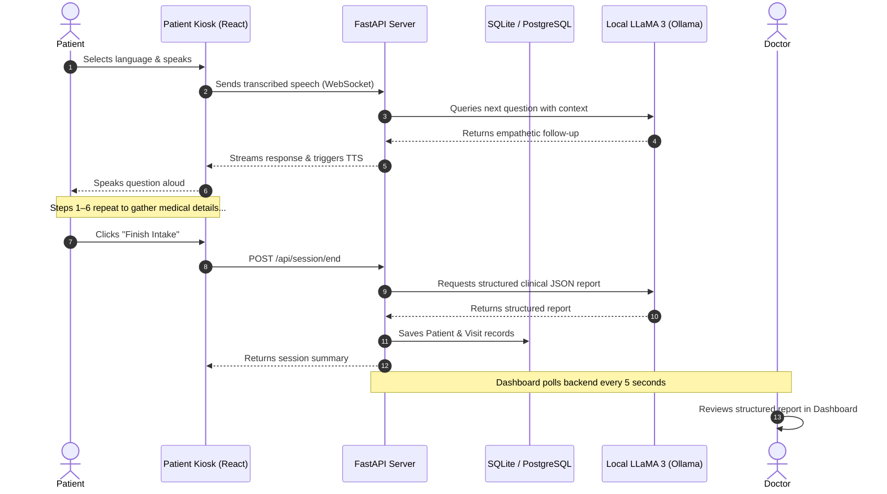

# 🏥 VoiceCare — AI-Powered Multilingual Medical Intake & Reception Agent

<div align="center">


[](https://www.python.org/)
[](https://react.dev/)
[](https://fastapi.tiangolo.com/)
[](https://ollama.com/)
[](./LICENSE)
[](https://github.com/kanalpawadi/Medical_Healthcare_Ai_Agent/pulls)

**A voice-first, privacy-preserving, multilingual patient intake system that runs 100% locally — no cloud, no PHI leaks.**

[🚀 Demo Video](https://drive.google.com/file/d/1zF3lXt7bxvl3PDpJQVlrqv3ZC07WTp-o/view?usp=sharing) · [📖 Docs](#installation--setup) · [🐛 Report Bug](https://github.com/kanalpawadi/Medical_Healthcare_Ai_Agent/issues) · [✨ Request Feature](https://github.com/kanalpawadi/Medical_Healthcare_Ai_Agent/issues)

</div>

---

## 📌 Table of Contents

- [About the Project](#-about-the-project)
- [Key Features](#-key-features)
- [Architecture & Flow](#️-architecture--flow)
- [Tech Stack](#️-tech-stack)
- [Screenshots](#-screenshots)
- [Installation & Setup](#-installation--setup)
- [Project Structure](#-project-structure)
- [Privacy & Compliance](#️-privacy--compliance)
- [Contributing](#-contributing)
- [License](#-license)

---

## 🩺 About the Project

**VoiceCare** is an interactive, voice-first medical reception kiosk and clinician dashboard designed to streamline patient onboarding in healthcare clinics and hospitals.

Patients simply walk up, speak in their language — **English, Hindi, or Kannada** — and VoiceCare's AI guides them through a natural conversation to collect their chief complaints, medical history, allergies, and demographics. The system then generates a **structured clinical report** for the doctor in real-time — before the patient even enters the consultation room.

> 💡 **Why VoiceCare?**
> Traditional intake forms are slow, error-prone, and inaccessible to patients with low digital literacy or language barriers. VoiceCare solves this with a conversational, voice-driven, AI-powered experience — and does it all **on-premise**, keeping sensitive health data completely private.

---

## 🌟 Key Features

| Feature | Description |
|---|---|
| 🎙️ **Voice-First Kiosk** | Hands-free, speech-to-speech intake using browser-native Web Speech API |
| 🔒 **100% Local AI** | LLaMA 3 via Ollama — zero PHI sent to any external server |
| 🌐 **Multilingual** | English, Hindi (हिन्दी), and Kannada (ಕನ್ನಡ) with auto language detection |
| 📋 **Clinician Dashboard** | Real-time queue, structured reports, allergy/medication summaries, full transcripts |
| ⚡ **Real-time Streaming** | WebSocket-based streaming for instant AI responses |
| 🗄️ **Persistent Storage** | SQLite (dev) / PostgreSQL (prod) via SQLAlchemy ORM |
| 🎨 **Premium UI** | Glassmorphic dark-themed React UI with Tailwind CSS v4 |

---

## 🏗️ Architecture & Flow



---

## 🛠️ Tech Stack

### Frontend
- **React 19.x** — Component-based UI
- **Vite** — Lightning-fast build tool
- **Tailwind CSS v4** — Utility-first styling with custom theme variables
- **Lucide React** — Clean icon system
- **React Router DOM v7** — Client-side routing
- **Web Speech API** — Browser-native SpeechRecognition & SpeechSynthesis

### Backend
- **FastAPI** — Async Python web framework
- **WebSockets** — Real-time bidirectional streaming
- **SQLAlchemy** — ORM for database models
- **SQLite** (dev) / **PostgreSQL** (prod) — Persistent storage
- **Uvicorn** — ASGI server

### AI / LLM Engine
- **Ollama** — Local LLM runner
- **LLaMA 3 (8B)** — Conversational AI model for question generation & report extraction

---

## 📸 Screenshots

> 🎬 **[Watch the full demo video here](https://drive.google.com/file/d/1zF3lXt7bxvl3PDpJQVlrqv3ZC07WTp-o/view?usp=sharing)**

| Patient Kiosk | Doctor Dashboard |
|---|---|
| Voice-driven multilingual intake | Real-time patient queue & clinical reports |

---

## 🚀 Installation & Setup

### Prerequisites

Make sure you have the following installed:

| Tool | Version | Link |
|---|---|---|
| Node.js | v18 or higher | [nodejs.org](https://nodejs.org/) |
| Python | v3.10 or higher | [python.org](https://www.python.org/) |
| Ollama | Latest | [ollama.com](https://ollama.com/) |

---

### Step 1: Set Up Ollama (Local LLM)

```bash
# Pull the LLaMA 3 model
ollama pull llama3

# Verify Ollama is running at http://localhost:11434
ollama serve
```

---

### Step 2: Backend Setup

```bash
# Navigate to backend
cd backend

# Create virtual environment
python3 -m venv .venv

# Activate — Mac/Linux
source .venv/bin/activate

# Activate — Windows (PowerShell)
# .venv\Scripts\Activate.ps1

# Install dependencies
pip install -r requirements.txt

# Start the FastAPI server
uvicorn main:app --reload --host 127.0.0.1 --port 8000
```

✅ API available at: `http://127.0.0.1:8000`  
📖 Swagger docs at: `http://127.0.0.1:8000/docs`

---

### Step 3: Frontend Setup

```bash
# In a new terminal, navigate to frontend
cd frontend

# Install npm packages
npm install

# Start the dev server
npm run dev
```

✅ Open your browser at: `http://localhost:5173`

---

## 📂 Project Structure

```
Medical_Healthcare_Ai_Agent/
├── backend/
│   ├── app/
│   │   ├── api/
│   │   │   └── patients.py          # Endpoints: sessions, queue, reports
│   │   ├── core/
│   │   │   └── database.py          # SQLAlchemy DB configuration
│   │   ├── models/
│   │   │   ├── patient.py           # Patient database schema
│   │   │   └── visit.py             # Visit & medical report schema
│   │   └── services/
│   │       ├── ai_engine.py         # LLaMA 3 integration & data parser
│   │       └── session_store.py     # Ephemeral session message tracker
│   ├── main.py                      # API entry point & WebSocket handler
│   ├── requirements.txt             # Python dependencies
│   └── voicecare.db                 # Local SQLite database
├── frontend/
│   ├── src/
│   │   ├── pages/
│   │   │   ├── Home.jsx             # Portal landing page
│   │   │   ├── Kiosk.jsx            # Patient voice interaction page
│   │   │   └── DoctorDashboard.jsx  # Clinician queue & report viewer
│   │   ├── App.jsx                  # Route definitions
│   │   ├── main.jsx                 # Application root
│   │   └── index.css                # Tailwind CSS v4 custom theme
│   ├── package.json                 # Frontend dependencies & scripts
│   └── vite.config.js               # Vite + Tailwind CSS plugin config
└── README.md
```

---

## 🛡️ Privacy & Compliance

VoiceCare is designed with **privacy-first** principles:

- 🔒 **No cloud API calls** — All LLM inference runs locally via Ollama
- 🏥 **HIPAA Compatible** — PHI never leaves the hospital network
- 🇪🇺 **GDPR Compatible** — No external data processing or storage
- 🎤 **Browser-native STT** — Speech recognition handled on-device via Web Speech API
- 🗄️ **Local Database** — Patient records stored in on-premise SQLite/PostgreSQL

---

## 🤝 Contributing

Contributions are welcome and appreciated!

1. Fork the repository
2. Create your feature branch: `git checkout -b feature/AmazingFeature`
3. Commit your changes: `git commit -m 'Add some AmazingFeature'`
4. Push to the branch: `git push origin feature/AmazingFeature`
5. Open a Pull Request

Please make sure to update tests as appropriate and follow the existing code style.

---

## 👤 Author

**Pawadi Piragond Kanal**  
DKTE Society's Textile & Engineering Institute  
GitHub: [@kanalpawadi](https://github.com/kanalpawadi)

---

## 📄 License

This project is licensed under the **MIT License** — see the [LICENSE](./LICENSE) file for details.

---

<div align="center">

Made with ❤️ for better, more accessible healthcare

⭐ **Star this repo if you found it useful!** ⭐

</div>