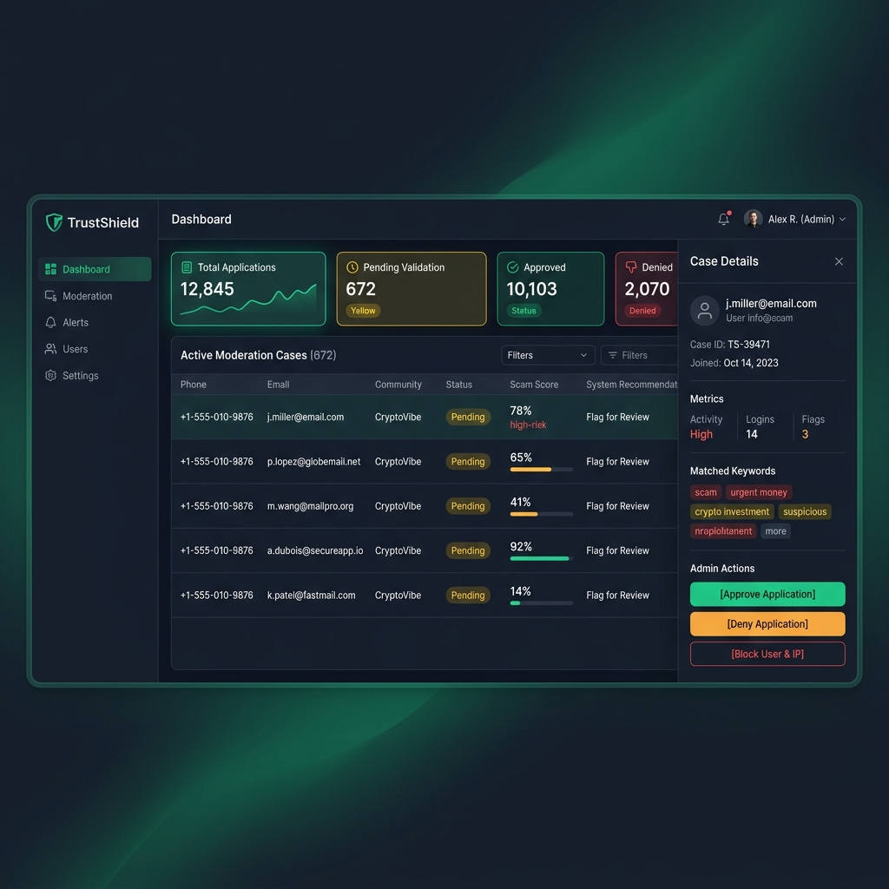
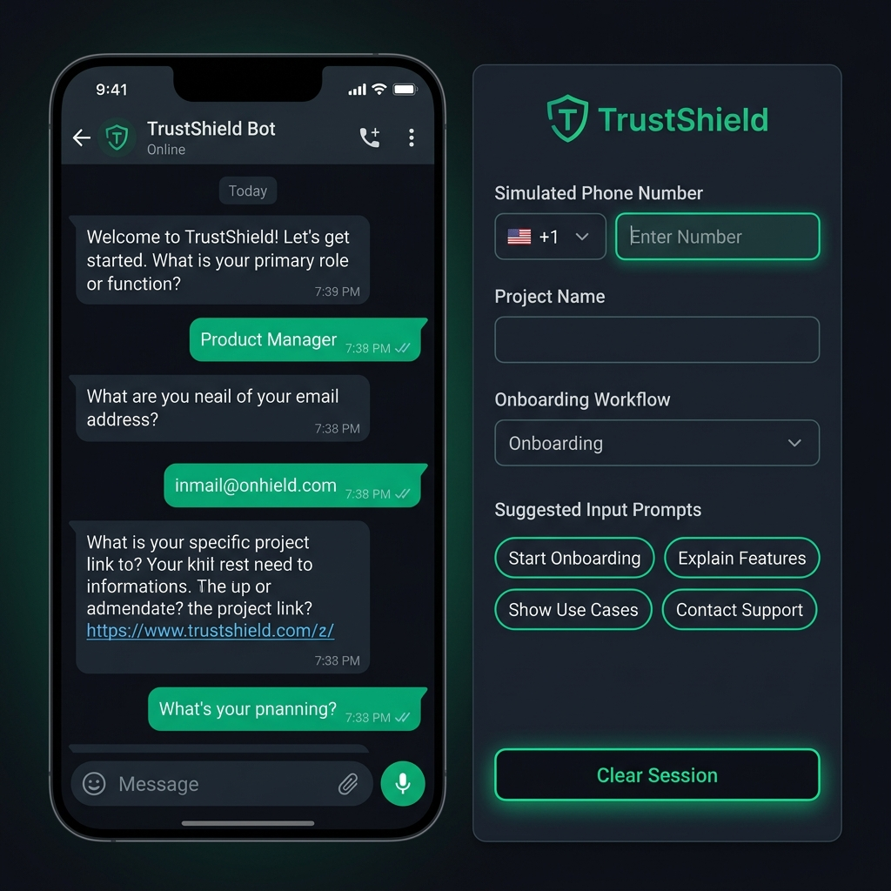

# Open Source Hackathon 2026 Project Submission

## Participant Details

**Full Name:**  
Rohan Chand M

**GitHub Username:**  
rohan-chand-m-01

**Team Name:**  
heapify

**College/University:**  
MS Ramaiah Institute of Technology

---

## Project Details

**Project Title:**  
TrustShield

**Project Description:**  
TrustShield is a monorepo security suite and automated moderation gateway designed to protect chat communities (like WhatsApp channels) from spam, phishing links, and malicious accounts. It intercepts applicant requests through a Redis-driven conversational onboarding questionnaire, analyzes the metadata through an async policy engine checking scam keyword hits, domain creation dates (WHOIS JSON API), and adult image filters (ModerateContent API), and provides a premium admin dashboard to approve, deny, or block users.

**Tech Stack Used:**  
FastAPI, SQLAlchemy, PostgreSQL, Redis, Next.js 16 (App Router), Tailwind CSS 4, React 19, TypeScript

**GitHub Repository Link:**  
https://github.com/rohan-chand-m-01/Whatsapp-Bot

**Live Demo Link:**  
http://localhost:3000

**Presentation / Demo Video Link:**  
*To be uploaded*

---

## Web Interface Mockups

### 1. Admin Dashboard Interface

### 2. WhatsApp Bot Conversation Simulator

---

## Open Source Readiness

- [x] My project is public on GitHub
- [x] My repository has a proper README.md
- [x] I have added setup/installation instructions
- [x] I have added screenshots/demo where possible
- [x] I have added a license file
- [x] My project is original and built/updated during the hackathon period

---

## Memori Labs Sponsor Task

Please complete these before submitting:

- [x] I have starred the Memori Labs GitHub repository  
  https://github.com/MemoriLabs/Memori

- [x] I have followed Memori Labs on LinkedIn  
  https://www.linkedin.com/company/memorilabs/

- [x] I have followed Memori Labs on X  
  https://x.com/memorilab

- [x] I have checked Memori Labs social links  
  https://linktr.ee/memorilabs

---

## ID Card Verification

- [x] I have generated my ID card from https://oshack.xyz
- [x] If my ID was not verified, I completed the mandatory verification/giveaway form and tried again (Verified successfully)

---
